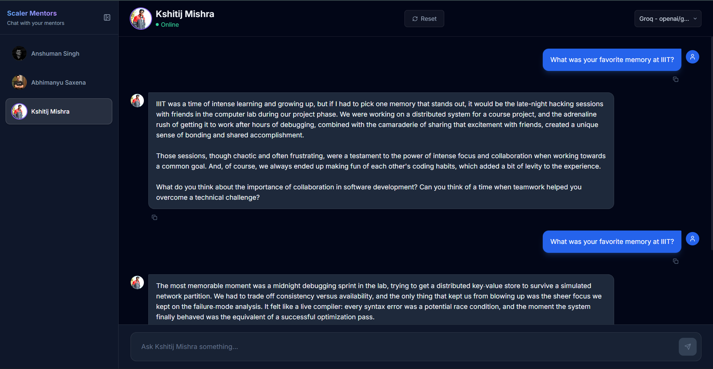

# Persona-Based AI Chatbot

A working persona-based AI chatbot for the Scaler Academy prompt engineering assignment. The app lets users chat with three distinct Scaler/InterviewBit personalities: Anshuman Singh, Abhimanyu Saxena, and Kshitij Mishra.

## Live Project

- Frontend: https://persona-chat-bot.netlify.app
- Backend API: https://persona-chat-bot-backend.onrender.com
- GitHub Repository: https://github.com/vimalyad/persona_chat_bot

## Screenshot



## Features

- Three separate personas: Anshuman Singh, Abhimanyu Saxena, and Kshitij Mishra
- Distinct system prompt for each persona
- Persona switcher with active mentor clearly visible
- Per-persona suggestion chips for quick-start questions
- Streaming responses with a typing/thinking indicator
- User-friendly API error handling with retry support
- Responsive layout for mobile and desktop
- Environment-based API key handling
- Isolated chat sessions per persona

Note: Each persona keeps its own separate conversation history. This was an intentional mentor-style design choice approved by the instructor: switching personas updates the system prompt and isolates the conversation, while allowing users to return to a mentor and continue where they left off.

## Tech Stack

Frontend:
- React
- TypeScript
- Vite
- Tailwind CSS

Backend:
- Node.js
- Express
- TypeScript
- SQLite
- Google Gemini API
- Groq API

## Project Structure

```text
persona_chat_bot/
  backend/        Express API, model providers, sessions, system prompts
  frontend/       React chat interface
  prompts.md      Annotated persona prompts
  reflection.md   Assignment reflection
  .env.example    Required environment variables
  image.png       Deployed app screenshot
```

## Environment Variables

Copy `.env.example` and configure the values needed for your environment.

Backend:

```env
GEMINI_API_KEY=your_gemini_api_key_here
GROQ_API_KEY=your_groq_api_key_here
PORT=3001
```

Frontend:

```env
VITE_API_URL=https://persona-chat-bot-backend.onrender.com/api
```

No real API keys are committed to the repository.

## Local Setup

Install and run the backend:

```bash
cd backend
npm install
npm run dev
```

Install and run the frontend:

```bash
cd frontend
npm install
npm run dev
```

The frontend will call the API configured in `VITE_API_URL`.

## Build Commands

Backend:

```bash
cd backend
npm run build
npm start
```

Frontend:

```bash
cd frontend
npm run build
```

## Netlify Frontend Deployment

Use these settings on Netlify:

```text
Base directory: frontend
Build command: npm run build
Publish directory: dist
```

Set this Netlify environment variable:

```text
VITE_API_URL=https://persona-chat-bot-backend.onrender.com/api
```

## Assignment Checklist

- Public GitHub repository
- Live deployed frontend URL
- Deployed backend API
- `.env.example` present
- No API keys committed
- `prompts.md` contains all three annotated system prompts
- `reflection.md` is included
- Persona switcher is present
- Suggestion chips are present
- Typing indicator is present
- API errors are handled gracefully
- Mobile-responsive UI
